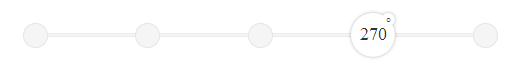

# 360° Slider

360° Slider is a UI Component Concept which enables a subject/product to be spun 360° and to be viewed at predetermined "hotspot angles"

View an interactive sample at www.derekknox.com/lab/360slider/.

## *Notes

This project is a simple rich prototype and could easily be culled from to create a more flexible/dynamic solution (utilize SVG vs. .png, make it a jQuery plugin, % based CSS, etc.). I just wanted to create a quick rich prototype that had some appeal to get a better feel of the interaction/behavior. Feel free to take it to the next level.

## License
	
	The MIT License (MIT)

	Copyright (c) 2014 Derek Knox | Braindrop Labs

	Permission is hereby granted, free of charge, to any person obtaining a copy
	of this software and associated documentation files (the "Software"), to deal
	in the Software without restriction, including without limitation the rights
	to use, copy, modify, merge, publish, distribute, sublicense, and/or sell
	copies of the Software, and to permit persons to whom the Software is
	furnished to do so, subject to the following conditions:

	The above copyright notice and this permission notice shall be included in all
	copies or substantial portions of the Software.

	THE SOFTWARE IS PROVIDED "AS IS", WITHOUT WARRANTY OF ANY KIND, EXPRESS OR
	IMPLIED, INCLUDING BUT NOT LIMITED TO THE WARRANTIES OF MERCHANTABILITY,
	FITNESS FOR A PARTICULAR PURPOSE AND NONINFRINGEMENT. IN NO EVENT SHALL THE
	AUTHORS OR COPYRIGHT HOLDERS BE LIABLE FOR ANY CLAIM, DAMAGES OR OTHER
	LIABILITY, WHETHER IN AN ACTION OF CONTRACT, TORT OR OTHERWISE, ARISING FROM,
	OUT OF OR IN CONNECTION WITH THE SOFTWARE OR THE USE OR OTHER DEALINGS IN THE
	SOFTWARE.

## Designed and Developed By
Derek Knox | Braindrop Labs

[@derekknox](https://twitter.com/derekknox)
